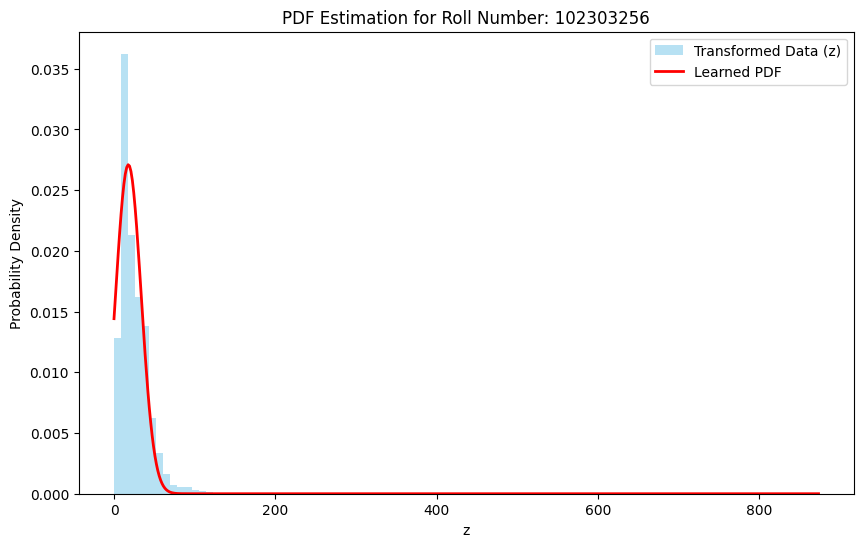

# Air Quality PDF Estimation using NO₂ Data

This project estimates a probability density function (PDF) from air quality data using a nonlinear transformation based on a university roll number. The analysis uses the NO₂ pollutant measurements from an  [ India Air Quality Dataset](https://www.kaggle.com/datasets/shrutibhargava94/india-air-quality-data).

It contains air pollution measurements collected from multiple monitoring stations across India, including important pollutants such as:

- PM2.5  
- PM10  
- NO₂  
- SO₂  
- CO  
- O₃
---
## Project Objective

The goal is to:
- Extract NO₂ measurements from the dataset.
- Apply a roll-number dependent nonlinear transformation.
- Estimate the probability density function (PDF) of the transformed data.
- Fit the distribution using nonlinear curve fitting.
---
## How to Run

```bash
import maths
maths.run_assignment(102303256, "india-air-quality-data.csv")
```
The script will :
- Load the dataset
- Compute roll-number parameters
- Transform the data
- Estimate the PDF
- Display the plot
---  
## Mathematical Formulation
```bash
x = NO₂ concentration
```
```bash
z = x + a_r sin(b_r x)
```
```bash
a_r = 0.5 (r mod 7)
b_r = 0.3 ((r mod 5) + 1)
```
and r is the university roll number.

---
### PDF Model
```bash
f(z) = c * exp(-λ (z − μ)²)
```
where:
- c = scaling constant
- λ = spread parameter
- μ = mean of distribution

These parameters are learned using nonlinear least squares fitting.

### Parameters

| Parameter | Value |
|-----------|-------|
| a_r | 3.000 |
| b_r | 0.600 |
| c | 0.027100 |
| λ (lambda) | 0.001992 |
| μ (mu) | 17.798141 |

### Visualization

Below is the histogram of the transformed variable along with the fitted probability density function.


---
